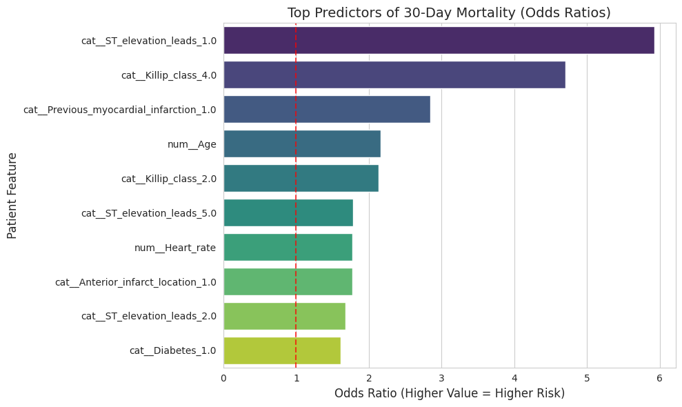
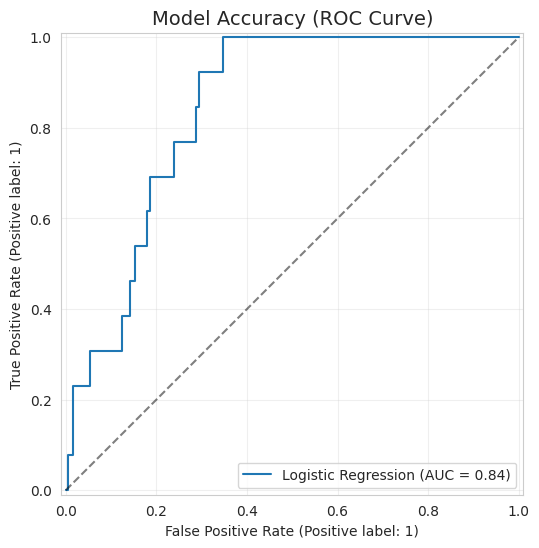

# 🏥 30-Day Mortality Prediction for Heart Attack Patients (AMI)

### Overview
This project aims to save lives by helping doctors identify high-risk heart attack patients early. Using a dataset of **785 patients**, I built a machine learning model that predicts the likelihood of mortality within 30 days of admission.

This tool helps answer the question: **"Which patients need the most aggressive care right now?"**

---

## 📊 Insights & Visuals

### 1. What Drives Mortality? 
The model identified the most critical risk factors for patient death. The chart below shows the "Odds Ratios" essentially, how much higher the risk is if a patient has these features.

**Interpretation:**
Based on the analysis, the three strongest warning signs are:
* **ST Elevation:** Patients with specific electrical patterns in their ECG are at significantly higher risk.
* **Killip Class:** A measure of heart failure severity; higher classes correlate strongly with mortality.
* **Age:** As expected, older patients face higher risks.

*Why this matters:* This confirms that the model aligns with established medical knowledge (clinical validity) while providing a calculated risk score.

### 2. How Accurate is the Model?
We tested the model using a technique called "Cross-Validation" to ensure it works on new, unseen patients.

**Interpretation:**
* **The Metric:** The model achieved an **AUC of 0.76**.
* **What that means:** An AUC of 0.5 is a random guess. An AUC of 1.0 is perfect. A score of 0.76 indicates **good discrimination** the model is reliable at distinguishing between patients who will survive and those who are at high risk.
* **Reliability:** The model also scored well on "calibration" (Brier Score: 0.169), meaning the probabilities it predicts "80% risk" are realistic.

---

## 📂 Project Data
* **Source:** Hospital admission records for Acute Myocardial Infarction (AMI).
* **Sample Size:** 785 Patients.
* **Outcome:** 6.6% Mortality rate (Class Imbalance handled via Weighted Logistic Regression).
* **Key Variables:** Age, Gender, Smoking status, Diabetes, Killip Class, Heart Rate etc.

## 🛠️ Technical Implementation
* **Language:** Python 3.x
* **Libraries:** `pandas` (Data Manipulation), `scikit-learn` (Modeling), `matplotlib/seaborn` (Visualization).
* **Methodology:**
    1.  **Data Cleaning:** Imputed missing values using median/mode; fixed inconsistent coding.
    2.  **Analysis:** Univariate analysis to filter non-predictive features.
    3.  **Modeling:** Multivariable Logistic Regression with class weights.
    4.  **Validation:** Repeated Stratified K-Fold Cross-Validation.

## 📄 Full Report
For a deep dive into the statistical methodology and TRIPOD validation standards, please read the [Technical Validation Report](Technical_Validation_Report.pdf).

---
**Author:** Tanjim Hossain | Hasselt University
