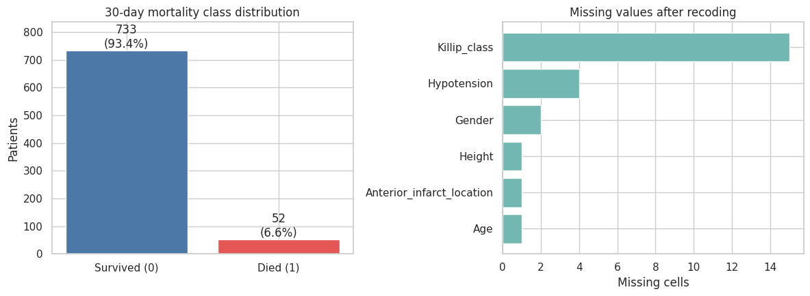
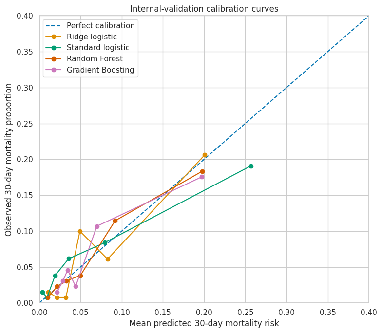
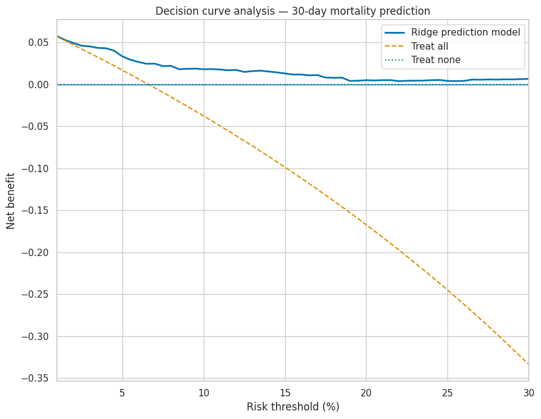
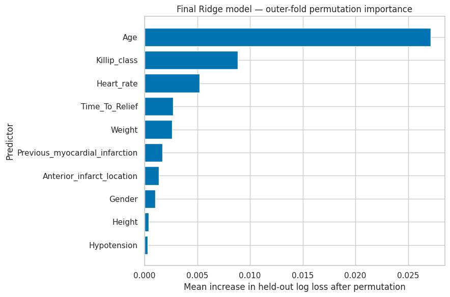

# 30-Day Mortality Prediction after Acute Myocardial Infarction

[](https://www.python.org/)
[](https://scikit-learn.org/)
[](#validation-design)
[](https://github.com/Tanjim-hossain/ami-30day-mortality-prediction/actions/workflows/ci.yml)

**End-to-end clinical prediction modelling · statistical learning · leakage-safe validation · reproducible machine learning**

This repository contains a complete prediction-modelling workflow for estimating **30-day mortality risk after acute myocardial infarction (AMI)**. The project covers the full analytical lifecycle: raw-data audit, reproducible cleaning, exploratory analysis, leakage-safe preprocessing, multiple statistical and machine-learning models, hyperparameter tuning, repeated nested cross-validation, class-imbalance experiments, calibration, bootstrap uncertainty, sensitivity analyses, threshold analysis, decision-curve analysis, model interpretation, and final model packaging.

The repository intentionally preserves the **full executed notebook with all analysis code and outputs**. The notebook is the most complete computational record; the reusable Python modules and result tables provide a cleaner engineering interface for reproduction and extension.

> **Important:** this is an internally validated prediction model. It has not been externally validated and should not be used as a clinical decision tool.

## Project at a glance

| Item | Value |
|---|---|
| Prediction target | 30-day mortality after AMI |
| Patients | **785** |
| Deaths | **52 (6.62%)** |
| Candidate predictors | **17** |
| Final model | **Ridge-penalised logistic regression** |
| Final regularisation | **C = 0.1** |
| Class rebalancing | **None** |
| Internal validation | **5-fold stratified outer CV × 5 repeats** |
| Hyperparameter tuning | **4-fold stratified inner CV** |
| Tuning objective | **Log loss** |
| ROC-AUC | **0.7881** |
| PR-AUC | **0.2783** |
| Brier score | **0.0556** |
| Log loss | **0.2070** |
| Calibration intercept | **0.1277** |
| Calibration slope | **1.0580** |

## Start here

- **Complete executed analysis:** [`notebooks/01_Complete_Executed_Analysis.ipynb`](notebooks/01_Complete_Executed_Analysis.ipynb)  
  Full 72-cell notebook with all 32 executed code cells, 126 preserved outputs, modelling experiments, validation steps, figures, assertions, sensitivity analyses, decision-curve analysis, permutation importance and model-packaging code.

- **Reproducible workflow notebook:** [`notebooks/02_Reproducible_Workflow.ipynb`](notebooks/02_Reproducible_Workflow.ipynb)  
  Cleaner script-backed notebook for re-running the current workflow.

- **Reusable pipeline:** [`src/mortality_prediction_pipeline.py`](src/mortality_prediction_pipeline.py)

- **Elastic-net development screen:** [`src/elastic_net_screen.py`](src/elastic_net_screen.py)

- **Technical report:** [`docs/TECHNICAL_REPORT.md`](docs/TECHNICAL_REPORT.md)

- **Validated numerical results:** [`results/tables/`](results/tables/)

---

## End-to-end analytical workflow


```mermaid
flowchart LR
    A[Raw AMI data] --> B[Schema and quality audit]
    B --> C[Auditable cleaning]
    C --> D[EDA and class imbalance assessment]
    D --> E[Leakage-safe preprocessing]
    E --> F[Repeated nested CV]
    F --> G[Elastic-net development]
    G --> H[Ridge / Logistic / RF / GB]
    H --> I[Model comparison]
    I --> J[Calibration and bootstrap uncertainty]
    J --> K[Sensitivity and imbalance ablations]
    K --> L[Threshold analysis and DCA]
    L --> M[Coefficients and permutation importance]
    M --> N[Final model packaging]
```

## 1. Data and quality audit

The dataset contains **785 patients**, **52 deaths** and **17 candidate predictors**.

The raw audit identified:

- 7 explicitly missing cells;
- 3 hypotension values encoded as `Unknown`;
- 14 invalid `Killip_class = -1` entries;
- two implausible height entries (`1.75` and `1690`);
- no exact duplicate rows;
- no duplicate predictor profiles.

Cleaning was deliberately conservative:

| Raw issue | Treatment |
|---|---|
| `Hypothension` header | renamed to `Hypotension` |
| `Hyperthension` header | renamed to `Hypertension` |
| `Hypothension = Unknown` | recoded as missing |
| `Killip_class = -1` | recoded as missing |
| `Height = 1.75` | corrected to 175 cm |
| `Height = 1690` | corrected to 169 cm |

No patient was removed. After recoding, there were **24 missing predictor cells**.



The rare outcome is analytically important: only **6.62%** of patients died within 30 days. A single train/test split would leave very few deaths in the test set, so the project uses repeated nested validation rather than relying on one holdout split.

## 2. Leakage-safe preprocessing

Every transformation that can learn from the data is fitted inside the relevant training fold.

| Predictor group | Processing |
|---|---|
| Continuous / ordinal | median imputation + standardisation |
| Binary | most-frequent-value imputation |
| Smoking | most-frequent-value imputation + one-hot encoding |
| Killip class | ordinal in the primary model |
| Random oversampling | training folds only, and only in the ablation analysis |

This prevents information from held-out observations from leaking into imputation statistics, scaling parameters, categorical encoding, resampling or hyperparameter selection.

## 3. Validation design

The main internal-validation architecture is **repeated nested stratified cross-validation**:

- **outer loop:** 5 stratified folds × 5 repeats = 25 held-out folds;
- **inner loop:** 4 stratified folds for hyperparameter selection;
- **tuning objective:** log loss;
- **random seed:** 2026.

Each patient receives one genuine out-of-fold probability in every outer repeat. These held-out predictions form the basis of the headline performance, calibration, uncertainty and threshold analyses.

## 4. Penalised logistic development

The first penalised logistic search used an Elastic Net:

- `C ∈ {0.01, 0.1, 1.0}`
- `l1_ratio ∈ {0, 0.25, 0.5, 0.75, 1.0}`

The selected solution landed at **`C = 0.1`, `l1_ratio = 0` in 20 of 25 outer folds**. The development path therefore strongly favoured the **ridge/L2 endpoint** rather than a sparse L1 solution.

Elastic-net out-of-fold performance:

| Metric | Value |
|---|---:|
| ROC-AUC | 0.7878 |
| PR-AUC | 0.2790 |
| Brier score | 0.0556 |
| Log loss | 0.2071 |

This motivated the final ridge formulation used in the matched model-comparison and imbalance experiments.

## 5. Candidate models

The analysis evaluates multiple statistical and machine-learning approaches under a common held-out validation framework:

- Elastic-net logistic regression
- Ridge logistic regression
- Standard logistic regression
- Random Forest
- Gradient Boosting
- Intercept-only prevalence reference

The full notebook includes the actual model construction, tuning grids, nested-validation loops, integrity assertions and output generation for these experiments.

## 6. Model comparison

| Model | ROC-AUC | PR-AUC | Brier | Log loss |
|---|---:|---:|---:|---:|
| **Ridge logistic** | **0.7881** | 0.2783 | **0.0556** | **0.2070** |
| Random Forest | 0.7806 | 0.2462 | 0.0564 | 0.2094 |
| Standard logistic | 0.7726 | **0.2816** | 0.0558 | 0.2127 |
| Gradient Boosting | 0.7509 | 0.2379 | 0.0571 | 0.2160 |
| Intercept-only reference | 0.4638 | 0.0631 | 0.0619 | 0.2438 |

Ridge was retained because it produced the strongest **overall** combination of discrimination, probability accuracy, calibration and repeated-validation stability. Selection was not based on ROC-AUC alone.

Repeat-level ridge stability:

- ROC-AUC: **0.7831 ± 0.0056**
- PR-AUC: **0.2610 ± 0.0310**
- Brier score: **0.0559 ± 0.0009**
- Log loss: **0.2084 ± 0.0026**

## 7. Class-imbalance ablation

The rare outcome motivated a direct comparison of three otherwise matched ridge strategies:

| Strategy | ROC-AUC | PR-AUC | Brier | Log loss |
|---|---:|---:|---:|---:|
| **No rebalancing** | **0.7881** | **0.2783** | **0.0556** | **0.2070** |
| Class weighting | 0.7746 | 0.2712 | 0.1711 | 0.5138 |
| Random oversampling | 0.7703 | 0.2700 | 0.1700 | 0.5108 |

Both rebalancing approaches substantially worsened probability quality, so the final model retained the natural event prevalence.

## 8. Calibration

The selected ridge model showed close agreement between predicted and observed overall risk:

- calibration intercept: **0.1277**
- calibration slope: **1.0580**
- mean predicted risk: **6.63%**
- observed mortality: **6.62%**



## 9. Uncertainty estimation

Headline metric uncertainty was estimated using **2,000 patient-level bootstrap resamples** of the internally validated out-of-fold prediction set.

| Metric | Estimate | 95% bootstrap CI |
|---|---:|---:|
| ROC-AUC | **0.7881** | 0.7236–0.8478 |
| PR-AUC | **0.2783** | 0.1741–0.4054 |
| Brier score | **0.0556** | 0.0423–0.0690 |
| Log loss | **0.2070** | 0.1658–0.2487 |

## 10. Sensitivity analyses

Two modelling assumptions were explicitly challenged.

| Specification | ROC-AUC | PR-AUC | Brier | Log loss |
|---|---:|---:|---:|---:|
| Primary ridge | 0.7881 | 0.2783 | 0.0556 | 0.2070 |
| Killip as categorical | 0.7786 | 0.2233 | 0.0567 | 0.2103 |
| Missing indicators added | 0.7889 | 0.2787 | 0.0556 | 0.2069 |

The primary ordinal Killip representation was retained. Missingness indicators did not provide a practically meaningful improvement over the simpler fold-specific imputation strategy.

## 11. Threshold trade-offs

The analysis does not optimise one clinical threshold on the development data. Instead, several illustrative risk thresholds are reported to make operating trade-offs transparent.

| Risk threshold | Sensitivity | Specificity | PPV | NPV | Patients flagged |
|---|---:|---:|---:|---:|---:|
| 5% | 78.8% | 61.9% | 12.8% | 97.6% | 40.8% |
| 10% | 53.8% | 83.1% | 18.4% | 96.2% | 19.4% |
| 15% | 38.5% | 92.5% | 26.7% | 95.5% | 9.6% |
| 20% | 23.1% | 95.6% | 27.3% | 94.6% | 5.6% |

These thresholds are descriptive and are not treatment recommendations.

## 12. Decision-curve analysis

Decision-curve analysis evaluates estimated net benefit against treat-all and treat-none strategies.



Ridge net benefit at key thresholds:

| Threshold | Ridge net benefit |
|---|---:|
| 5% | 0.0335 |
| 10% | 0.0181 |
| 15% | 0.0131 |
| 20% | 0.0051 |

Within the evaluated threshold grid, ridge showed greater estimated net benefit than both reference strategies over approximately 1%–30%. This remains an internal prediction analysis and does not establish causal treatment benefit.

## 13. Final model interpretation

The final full-data ridge model uses `C = 0.1`.

Largest absolute coefficients include:

| Predictor | Coefficient | Odds ratio |
|---|---:|---:|
| Age | 0.6554 | 1.9258 |
| Heart-rate indicator | 0.4691 | 1.5985 |
| Time to relief >1 hour | 0.3208 | 1.3783 |
| Previous myocardial infarction | 0.3139 | 1.3687 |
| Killip class | 0.3072 | 1.3596 |
| Anterior infarct location | 0.2750 | 1.3165 |
| Gender | -0.2190 | 0.8033 |
| Weight | -0.2167 | 0.8052 |
| Diabetes | 0.2082 | 1.2315 |
| Hypotension | 0.1742 | 1.1903 |

Continuous and ordinal predictors were standardised, so their odds ratios correspond approximately to a one-standard-deviation increase.

## 14. Held-out permutation importance

Permutation importance was evaluated in the **outer holdout folds**, not on the full training data. Each raw predictor was permuted 20 times per outer split while the fold-specific ridge model remained fixed.



The strongest predictive contributors were:

1. Age
2. Killip class
3. Heart-rate indicator
4. Time to relief
5. Weight

These are predictive contributions, not causal effects.

## 15. Model packaging and deployment readiness

The complete notebook includes final-model packaging code using `joblib` and writes:

```text
final_ridge_prediction_pipeline.joblib
final_ridge_model_metadata.json
```

The serialized object contains the preprocessing pipeline and fitted ridge model together so that new observations can be processed consistently at inference time.

This repository therefore demonstrates **model packaging and deployment readiness**. It does **not** claim that the model has been deployed as a production API or clinical service.

For the packaging details and inference boundary, see [`docs/DEPLOYMENT.md`](docs/DEPLOYMENT.md).

## Repository structure

```text
.
├── README.md
├── ami_patient_data.csv
├── requirements.txt
├── pyproject.toml
├── Makefile
├── CITATION.cff
├── .gitignore
├── .github/
│   └── workflows/
│       └── ci.yml
├── notebooks/
│   ├── 01_Complete_Executed_Analysis.ipynb
│   └── 02_Reproducible_Workflow.ipynb
├── src/
│   ├── mortality_prediction_pipeline.py
│   └── elastic_net_screen.py
├── results/
│   ├── figures/
│   │   ├── outcome_and_missingness.png
│   │   ├── calibration_curve.png
│   │   ├── decision_curve.png
│   │   └── permutation_importance.png
│   └── tables/
├── docs/
│   ├── TECHNICAL_REPORT.md
│   ├── METHODOLOGY.md
│   ├── RESULTS.md
│   ├── DATA_DICTIONARY.md
│   ├── DATA_USAGE.md
│   ├── MODEL_CARD.md
│   ├── DEPLOYMENT.md
│   └── REPRODUCIBILITY.md
└── tests/
    └── test_pipeline.py
```

## Reproduce the analysis

### 1. Clone the repository

```bash
git clone https://github.com/Tanjim-hossain/ami-30day-mortality-prediction.git
cd ami-30day-mortality-prediction
```

### 2. Create an environment

```bash
python -m venv .venv
source .venv/bin/activate        # Windows: .venv\Scripts\activate
pip install -r requirements.txt
```

### 3. Explore the complete executed analysis

Open:

```text
notebooks/01_Complete_Executed_Analysis.ipynb
```

This notebook already contains the full executed computational record and preserved outputs.

### 4. Re-run the reusable pipeline

```bash
python src/mortality_prediction_pipeline.py \
  --data ami_patient_data.csv \
  --output outputs/current
```

### 5. Re-run the elastic-net development screen

```bash
python src/elastic_net_screen.py \
  --data ami_patient_data.csv \
  --output outputs/elastic_net
```

### 6. Run quality checks

```bash
pytest -q
```

## Reproducibility settings

- Random seed: `2026`
- Python: `3.12`
- scikit-learn: `1.6.1`
- Outer validation: stratified 5-fold CV × 5 repeats
- Inner validation: stratified 4-fold CV
- Tuning criterion: log loss
- Final ridge `C`: `0.1`
- Class rebalancing: none
- Bootstrap resamples: 2,000
- Permutation repetitions: 20 per raw predictor per outer split

## Technical stack

`Python` · `NumPy` · `pandas` · `scikit-learn` · `imbalanced-learn` · `matplotlib` · `seaborn` · `joblib` · `Jupyter/Kaggle`

## Skills demonstrated

`data-quality auditing` · `EDA` · `missing-data handling` · `feature preprocessing` · `regularisation` · `logistic regression` · `Random Forest` · `Gradient Boosting` · `nested cross-validation` · `hyperparameter tuning` · `class-imbalance analysis` · `calibration` · `bootstrap uncertainty` · `sensitivity analysis` · `decision-curve analysis` · `permutation importance` · `model packaging` · `reproducible ML workflows` · `testing / CI`

## Limitations and responsible use

- Only 52 events were available, so uncertainty remains substantial.
- Validation is internal only.
- No temporal, geographic or external-site validation was available.
- Threshold analyses are illustrative rather than prescriptive.
- Coefficients and permutation importance describe predictive associations, not causal effects.
- The model should not be used for diagnosis, triage, treatment allocation or direct clinical decision-making without independent external validation and appropriate clinical governance.

## Author

**Tanjim Hossain**

Data Science / Statistical Learning project.
