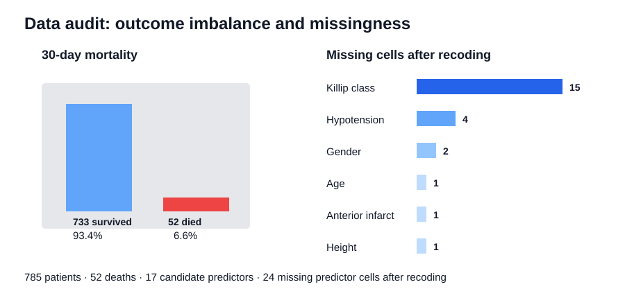
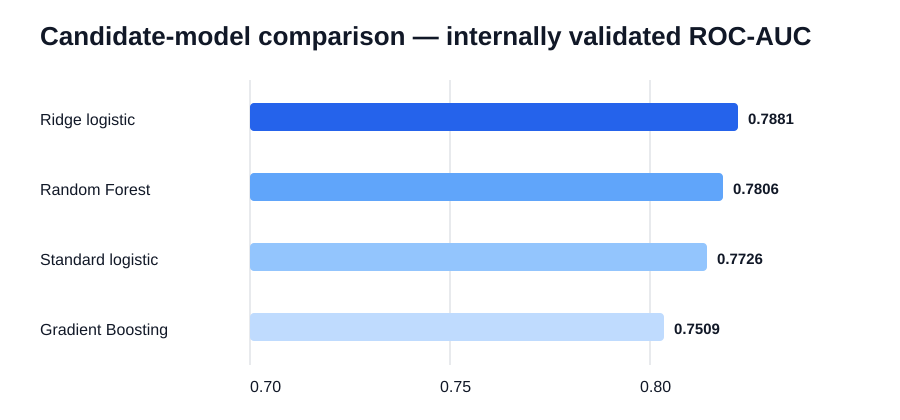
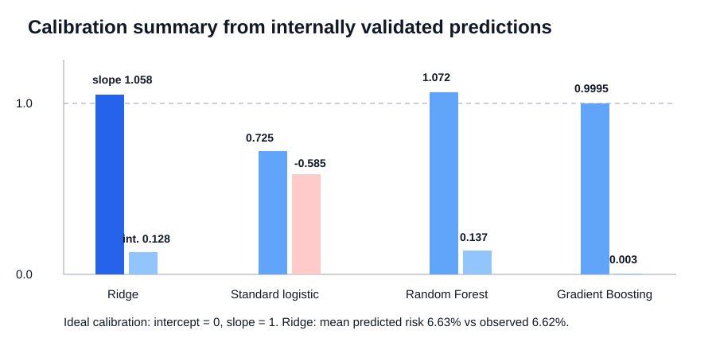
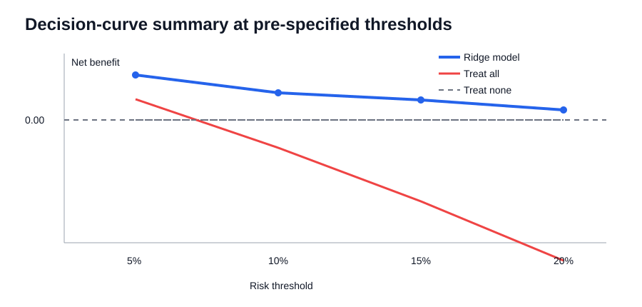
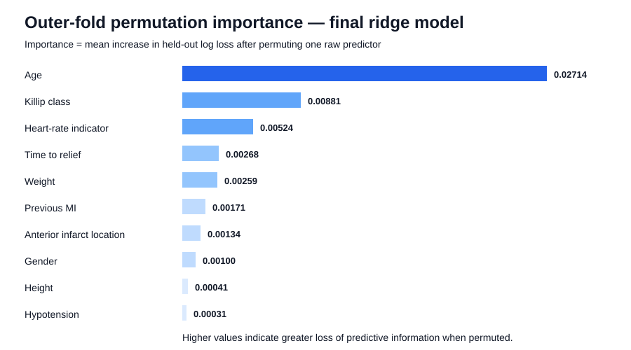

# 30-Day Mortality Prediction after Acute Myocardial Infarction

[](https://www.python.org/)
[](https://scikit-learn.org/)
[](#validation-design)
[](#limitations-and-responsible-use)
[](https://github.com/Tanjim-hossain/ami-30day-mortality-prediction/actions/workflows/ci.yml)

**Clinical prediction · statistical learning · leakage-safe validation · reproducible machine learning**

This project develops and internally validates a multivariable model for estimating **30-day mortality risk after acute myocardial infarction (AMI)**. It was completed for the *Inference for Statistics and Data Science* course at Hasselt University and is presented here as a reproducible data-science portfolio project.

> **Plain-language summary:** the goal is to estimate which AMI patients are more likely to die within 30 days using information available in the supplied dataset. The final model is a regularised logistic regression. It performs meaningfully better than a prevalence-only reference while preserving good probability calibration, but it has **not** been externally validated and is **not a clinical decision tool**.

## Project at a glance

| Item | Value |
|---|---|
| Prediction target | 30-day mortality after AMI |
| Patients | **785** |
| Deaths | **52 (6.62%)** |
| Candidate predictors | **17** |
| Final model | **Ridge-penalised logistic regression** |
| Final regularisation | **C = 0.1** |
| Class rebalancing | **None** |
| Internal validation | **5-fold stratified outer CV × 5 repeats** |
| Hyperparameter tuning | **4-fold stratified inner CV** |
| Tuning objective | **Log loss** |
| ROC-AUC | **0.7881** |
| PR-AUC | **0.2783** |
| Brier score | **0.0556** |
| Log loss | **0.2070** |
| Calibration intercept | **0.1277** |
| Calibration slope | **1.0580** |

## Why this repository is more than a notebook

The project records the complete modelling lifecycle:

- raw-data quality audit and traceable cleaning;
- missing-data handling inside training folds;
- leakage-safe scaling and encoding;
- elastic-net feature/complexity control;
- ridge, standard logistic regression, Random Forest and Gradient Boosting;
- repeated nested cross-validation;
- matched class-imbalance ablations;
- calibration assessment;
- 2,000-sample bootstrap uncertainty;
- sensitivity analyses;
- threshold trade-off analysis;
- decision-curve analysis;
- held-out permutation importance;
- reproducible source code, tests, documentation and machine-readable result tables.

The **full executed notebook with its original outputs is included** in [`notebooks/01_Full_Analysis_Executed.ipynb`](notebooks/01_Full_Analysis_Executed.ipynb). A cleaner script-oriented workflow is available in [`src/`](src/) and [`notebooks/02_Reproducible_Workflow.ipynb`](notebooks/02_Reproducible_Workflow.ipynb).

---

## The modelling workflow


```mermaid
flowchart LR
    A[Raw AMI data] --> B[Schema & quality audit]
    B --> C[Auditable cleaning]
    C --> D[Leakage-safe preprocessing]
    D --> E[Repeated nested CV]
    E --> F[Elastic-net development]
    F --> G[Candidate model comparison]
    G --> H[Ridge selected]
    H --> I[Calibration + bootstrap uncertainty]
    I --> J[Sensitivity + imbalance ablations]
    J --> K[Thresholds + decision curve]
    K --> L[Coefficients + held-out permutation importance]
```

## Data audit

The supplied dataset contains 785 patients, 52 deaths and 17 candidate predictors. The raw audit identified:

- 7 explicitly missing cells;
- 3 `Hypothension` values encoded as `Unknown`;
- 14 `Killip_class` values encoded as `-1`;
- two implausible height entries (`1.75` and `1690`);
- no exact duplicate rows;
- no duplicate predictor profiles.

Cleaning was deliberately conservative: invalid codes were recoded to missing, the two height unit-entry errors were corrected to 175 cm and 169 cm, misspelled headers were normalised, and **no patient was removed**. After recoding, 24 predictor cells were missing.



The low event count is important. With only 52 deaths, a single train/test split would waste information and produce an unstable test set. It also makes raw accuracy misleading. This motivated repeated nested validation, proper scoring rules and regularisation.

## Leakage-safe preprocessing

All transformations that can learn from the data are fitted **inside the relevant training fold**.

| Predictor group | Primary handling |
|---|---|
| Continuous / ordinal | Median imputation + standardisation |
| Binary | Most-frequent-value imputation |
| Smoking | Most-frequent-value imputation + one-hot encoding |
| Killip class | Ordinal in the primary analysis |
| Oversampling | Training folds only, and only in the ablation experiment |

This prevents imputation statistics, scaling parameters, encoded levels, resampling or hyperparameter selection from leaking information from held-out observations.

## Validation design

The primary internal validation uses:

- **outer loop:** 5-fold stratified CV × 5 repeats = 25 held-out folds;
- **inner loop:** 4-fold stratified CV for tuning;
- **selection criterion:** log loss;
- **random seed:** 2026.

Each patient receives one genuine out-of-fold probability in each outer repeat. The five out-of-fold probabilities are averaged for the headline patient-level estimates, while repeat-level metrics are retained to assess stability.

## Elastic-net development and model selection

The initial penalised logistic search used:

- `C ∈ {0.01, 0.1, 1.0}`;
- `l1_ratio ∈ {0, 0.25, 0.5, 0.75, 1}`.

The selected solution landed at **`C = 0.1`, `l1_ratio = 0` in 20 of 25 outer folds**. In other words, the data consistently preferred the **ridge/L2 end** of the elastic-net path rather than a sparse hard subset. The elastic-net development model itself achieved ROC-AUC 0.7878 and log loss 0.2071.

This is why the final matched modelling experiments use a numerically stable ridge logistic specification.

## Candidate-model comparison



| Model | ROC-AUC | PR-AUC | Brier | Log loss |
|---|---:|---:|---:|---:|
| **Ridge logistic** | **0.7881** | 0.2783 | **0.0556** | **0.2070** |
| Random Forest | 0.7806 | 0.2462 | 0.0564 | 0.2094 |
| Standard logistic | 0.7726 | **0.2816** | 0.0558 | 0.2127 |
| Gradient Boosting | 0.7509 | 0.2379 | 0.0571 | 0.2160 |
| Intercept-only reference | 0.4638 | 0.0631 | 0.0619 | 0.2438 |

Ridge was retained because it offered the best **overall** balance of discrimination, probability accuracy, calibration and repeated-validation stability. The selection was not based on ROC-AUC alone.

## Class-imbalance ablation

Mortality prevalence is only 6.62%, so imbalance handling was treated as an empirical modelling choice rather than an automatic step.

| Ridge strategy | ROC-AUC | PR-AUC | Brier | Log loss |
|---|---:|---:|---:|---:|
| **No rebalancing** | **0.7881** | **0.2783** | **0.0556** | **0.2070** |
| Class weighting | 0.7746 | 0.2712 | 0.1711 | 0.5138 |
| Random oversampling | 0.7703 | 0.2700 | 0.1700 | 0.5108 |

Both rebalancing approaches worsened probability quality substantially, so the final model retains the natural class distribution.

## Calibration and uncertainty

The final ridge model has:

- calibration intercept **0.1277**;
- calibration slope **1.0580**;
- mean predicted mortality risk **6.63%**;
- observed mortality **6.62%**.



Patient-level bootstrap uncertainty was calculated from **2,000 resamples** of the internally validated out-of-fold predictions.

| Metric | Estimate | 95% bootstrap CI |
|---|---:|---:|
| ROC-AUC | **0.7881** | 0.7236–0.8478 |
| PR-AUC | **0.2783** | 0.1741–0.4054 |
| Brier score | **0.0556** | 0.0423–0.0690 |
| Log loss | **0.2070** | 0.1658–0.2487 |

## Sensitivity analyses

| Specification | ROC-AUC | PR-AUC | Brier | Log loss |
|---|---:|---:|---:|---:|
| Primary ridge | 0.7881 | 0.2783 | 0.0556 | 0.2070 |
| Killip as categorical | 0.7786 | 0.2233 | 0.0567 | 0.2103 |
| Missing indicators added | 0.7889 | 0.2787 | 0.0556 | 0.2069 |

The results support the simpler primary specification: ordinal Killip coding and fold-specific imputation without explicit missingness indicators.

## Threshold trade-offs

The project deliberately does **not** optimise a single clinical threshold on the development data. Instead, several illustrative risk thresholds are shown to make the operating trade-off transparent.

| Risk threshold | Sensitivity | Specificity | PPV | NPV | Patients flagged |
|---|---:|---:|---:|---:|---:|
| 5% | 78.8% | 61.9% | 12.8% | 97.6% | 40.8% |
| 10% | 53.8% | 83.1% | 18.4% | 96.2% | 19.4% |
| 15% | 38.5% | 92.5% | 26.7% | 95.5% | 9.6% |
| 20% | 23.1% | 95.6% | 27.3% | 94.6% | 5.6% |

These are **descriptive risk thresholds**, not treatment recommendations.

## Decision-curve analysis



At 5%, 10%, 15% and 20% thresholds, ridge net benefit was 0.0335, 0.0181, 0.0131 and 0.0051. Within the notebook's evaluated grid, the model had greater estimated net benefit than both reference strategies over approximately 1%–30%. Because this is an internally validated prediction study, this does not establish the causal benefit of acting on model predictions.

## Model interpretation

The final full-data ridge model is refitted only after internal model selection. Performance claims remain based on held-out predictions, not on the refit.

Largest absolute coefficients include:

| Predictor | Coefficient | Odds ratio |
|---|---:|---:|
| Age | 0.6554 | 1.9258 |
| Heart-rate indicator | 0.4691 | 1.5985 |
| Time to relief >1 hour | 0.3208 | 1.3783 |
| Previous myocardial infarction | 0.3139 | 1.3687 |
| Killip class | 0.3072 | 1.3596 |
| Anterior infarct location | 0.2750 | 1.3165 |

Continuous/ordinal predictors were standardised, so their odds ratios correspond approximately to a **one-standard-deviation increase**, not a raw one-unit change.

Held-out raw-predictor permutation importance identified **Age** as the dominant predictive contributor, followed by **Killip class**, **heart-rate indicator**, **time to relief**, and **weight**.



Small negative permutation-importance values can occur from sampling variation and correlated predictors; they should not be interpreted as protective causal effects.

## Repository structure

```text
.
├── README.md
├── ami_patient_data.csv
├── requirements.txt
├── Makefile
├── pyproject.toml
├── CITATION.cff
├── .gitignore
├── .github/
│   └── workflows/
│       └── ci.yml
├── notebooks/
│   ├── 01_Full_Analysis_Executed.ipynb
│   └── 02_Reproducible_Workflow.ipynb
├── src/
│   ├── isds_option_a_pipeline.py
│   └── elastic_net_screen.py
├── results/
│   ├── README.md
│   └── tables/
│       ├── candidate_model_performance.csv
│       ├── class_imbalance_ablation.csv
│       ├── bootstrap_95ci.csv
│       ├── calibration_summary.csv
│       ├── sensitivity_analyses.csv
│       ├── threshold_metrics.csv
│       ├── decision_curve_key_thresholds.csv
│       ├── final_ridge_coefficients.csv
│       ├── permutation_importance.csv
│       └── elastic_net_selection_frequency.csv
├── docs/
│   ├── TECHNICAL_REPORT.md
│   ├── METHODOLOGY.md
│   ├── RESULTS.md
│   ├── DATA_DICTIONARY.md
│   ├── MODEL_CARD.md
│   ├── TRIPOD_MAPPING.md
│   ├── LEGACY_ARTIFACTS.md
│   └── assets/
└── tests/
    └── test_pipeline.py
```

## Reproduce the analysis

### 1. Clone and create an environment

```bash
git clone https://github.com/Tanjim-hossain/ami-30day-mortality-prediction.git
cd ami-30day-mortality-prediction

python -m venv .venv
source .venv/bin/activate        # Windows: .venv\Scripts\activate
pip install -r requirements.txt
```

### 2. Run the reusable pipeline

```bash
python src/isds_option_a_pipeline.py \
  --data ami_patient_data.csv \
  --output outputs/current
```

### 3. Reproduce the initial elastic-net selection

```bash
python src/elastic_net_screen.py \
  --data ami_patient_data.csv \
  --output outputs/elastic_net
```

### 4. Run quality checks

```bash
pytest -q
```

The full pipeline is computationally heavier than a single train/test analysis because it repeatedly performs preprocessing, tuning and held-out evaluation.

## Technical stack

**Python 3.12.13** · **NumPy 2.0.2** · **pandas 2.3.3** · **scikit-learn 1.6.1** · **matplotlib 3.10.0** · **seaborn 0.13.2** · imbalanced-learn · joblib · Jupyter/Kaggle

## Skills demonstrated

`EDA` · `data-quality auditing` · `missing-data handling` · `feature engineering` · `regularisation` · `logistic regression` · `Random Forest` · `Gradient Boosting` · `nested cross-validation` · `hyperparameter tuning` · `class-imbalance ablation` · `calibration` · `bootstrap uncertainty` · `decision-curve analysis` · `permutation importance` · `TRIPOD-oriented reporting` · `reproducible ML pipelines` · `testing/CI`

## Documentation

- [Full technical report](docs/TECHNICAL_REPORT.md)
- [Methodology](docs/METHODOLOGY.md)
- [Validated results](docs/RESULTS.md)
- [Data dictionary](docs/DATA_DICTIONARY.md)
- [Model card](docs/MODEL_CARD.md)
- [TRIPOD / assignment traceability](docs/TRIPOD_MAPPING.md)
- [Legacy-artifact note](docs/LEGACY_ARTIFACTS.md)
- [Machine-readable result tables](results/tables/)

## Limitations and responsible use

This model was developed from a single supplied dataset with only 52 outcome events. All performance estimates are **internal-validation estimates**. There is no external validation, temporal validation or independent-site validation. Transportability to another hospital, country, treatment era or patient population is unknown.

The analysis is predictive rather than causal. Coefficients, odds ratios and permutation importance should not be interpreted as treatment effects or biological mechanisms. The threshold and decision-curve analyses are exploratory and are not clinical recommendations.

**Do not use this repository for direct patient-care decisions.**

---

**Author:** Tanjim Hossain  
**Programme:** MSc Statistics and Data Science — Data Science, Hasselt University  
**Course project:** Inference for Statistics and Data Science, Option A — Prediction Modelling
